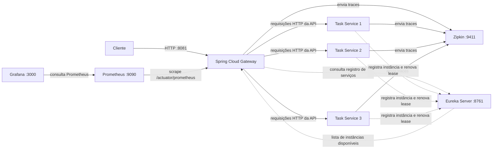

# TaskFlow — laboratório de microsserviços

Projeto de estudo sobre microsserviços com **Java 21**, **Spring Boot**, **Spring Cloud Gateway**, **Eureka** e **Docker Compose**. O Gateway recebe as chamadas dos clientes, descobre os serviços pelo Eureka e distribui as requisições entre três instâncias do serviço de tarefas.

## Arquitetura



| Componente | Função | Acesso local |
|---|---|---|
| `gateway` | Roteamento, balanceamento, retry, timeout e circuit breaker | `http://localhost:8081` |
| `eureka-server` | Registro e descoberta de serviços | `http://localhost:8761` |
| `task-service-1` | Primeira instância da API de tarefas | Rede interna Docker, porta `8080` |
| `task-service-2` | Segunda instância da API de tarefas | Rede interna Docker, porta `8080` |
| `task-service-3` | Terceira instância da API de tarefas | Rede interna Docker, porta `8080` |
| `prometheus` | Coleta métricas do Gateway | `http://localhost:9090` |
| `grafana` | Dashboards para visualizar métricas do Prometheus | `http://localhost:3000` |
| `zipkin` | Coleta e visualização de traces distribuídos | `http://localhost:9411` |

As setas pontilhadas mostram o plano de descoberta: as instâncias registram e renovam seus leases no Eureka, e o Gateway obtém dele a lista de instâncias disponíveis. O Eureka não recebe nem encaminha as chamadas de negócio. As setas contínuas mostram o tráfego da API: o Gateway escolhe uma instância e encaminha a requisição HTTP diretamente a ela.

As instâncias Task Service não publicam suas portas no host. O acesso externo às APIs é feito pelo Gateway. No Compose, o Gateway publica a porta `8081` do host e encaminha para a porta `8080` do container.

## Requisitos

- Docker com Docker Compose plugin
- Portas `8081`, `8761`, `9090`, `3000` e `9411` livres no host

## Executar

Na raiz do repositório:

```bash
docker compose up --build -d
```

Acompanhar os logs:

```bash
docker compose logs -f gateway eureka-server task-service-1 task-service-2 task-service-3 prometheus grafana zipkin
```

Verificar os containers:

```bash
docker compose ps
```

Encerrar o ambiente:

```bash
docker compose down
```

Para definir a versão informativa das aplicações, passe `APP_VERSION` ao Compose:

```bash
APP_VERSION=1.2.0 docker compose up --build -d
```

O valor padrão é `1.0.0`.

## Endpoints

### Listar tarefas

```bash
curl http://localhost:8081/api/v1/tasks
```

Exemplo de resposta:

```json
{
  "service": "task-service",
  "instance": "instancia 2",
  "tasks": [
    { "id": 1, "title": "Estudar microsserviços" },
    { "id": 2, "title": "Aprender API Gateway" }
  ]
}
```

O número em `instance` identifica qual das três instâncias respondeu. O balanceador escolhe uma instância registrada no Eureka; a sequência pode variar.

### Health checks do serviço de tarefas

O Gateway encaminha os caminhos abaixo para os endpoints Actuator do Task Service:

```bash
curl http://localhost:8081/api/v1/health
curl http://localhost:8081/api/v1/health/liveness
curl http://localhost:8081/api/v1/health/readiness
```

Os endpoints diretos do Actuator existem dentro de cada instância, mas as instâncias não são publicadas diretamente no host.

### Métricas e Prometheus

O Gateway e o Task Service expõem os endpoints Actuator de métricas. O Prometheus configurado em `prometheus/prometheus.yaml` coleta o Gateway e as três réplicas do Task Service pela rede interna do Compose, em `/actuator/prometheus`.

- Interface do Prometheus: `http://localhost:9090`
- Métricas do Gateway em formato Prometheus: `http://localhost:8081/actuator/prometheus`
- Catálogo de métricas do Gateway: `http://localhost:8081/actuator/metrics`

Exemplo para consultar o endpoint Prometheus do Gateway:

```bash
curl http://localhost:8081/actuator/prometheus
```

As três réplicas do Task Service aparecem no Prometheus no job `task-service`; a label `instance` distingue cada container.

### Grafana

Abra `http://localhost:3000` e entre com o usuário e a senha padrão `admin`. O Grafana solicitará a troca da senha no primeiro acesso. A fonte Prometheus e o dashboard **TaskFlow - Gateway e Task Service** são provisionados automaticamente; o dashboard mostra memória heap, CPU, taxa de requisições e latência p95 do Gateway e das instâncias do Task Service. Os dados locais do Grafana são mantidos no volume `grafana_data`.

### Tracing distribuído

O Gateway e o Task Service propagam contexto W3C entre chamadas e exportam spans para o Zipkin. Para consultar os traces, abra `http://localhost:9411` e execute uma busca. O ambiente amostra 100% das requisições para facilitar o acompanhamento durante o desenvolvimento.

### Eureka

Abra `http://localhost:8761` para visualizar o painel do Eureka. O endpoint de registro também pode ser consultado com:

```bash
curl http://localhost:8761/eureka/apps
```

## Resiliência no Gateway

O Gateway está configurado com:

- **Timeout de conexão:** 1 segundo.
- **Timeout de resposta:** 3 segundos.
- **Retry:** até duas tentativas adicionais para requisições `GET` em falhas de upstream e timeouts configurados.
- **Circuit breaker:** breakers separados para tarefas e health; a configuração abre o circuito após pelo menos 5 chamadas na janela de 10, quando pelo menos 50% falham. O circuito permanece aberto por 10 segundos antes de permitir chamadas de recuperação.
- **Fallback:** quando o serviço não pode responder, o Gateway devolve HTTP `503` com um corpo JSON indicando indisponibilidade.

Exemplo de fallback para tarefas:

```json
{
  "service": "api-gateway",
  "error": "task-service-unavailable"
}
```

## Testes

Os módulos Java têm testes Maven. Para executá-los, entre no diretório de cada módulo:

```bash
(cd gateway && mvn test)
(cd task-service && mvn test)
(cd eureka-server && mvn test)
```

Há também verificações de configuração em `tests/`, por exemplo:

```bash
sh tests/test_gateway_timeout.sh
sh tests/test_gateway_failover.sh
sh tests/test_eureka_discovery.sh
sh tests/test_prometheus_config.sh
```

## Estrutura do repositório

```text
.
├── docker-compose.yml
├── prometheus/        # configuração de scrape do Gateway
├── grafana/           # datasource e dashboard provisionados
├── eureka-server/     # servidor Eureka
├── gateway/           # Spring Cloud Gateway e Resilience4j
├── task-service/      # API Spring Boot replicada em três containers
└── tests/             # verificações de configuração
```
